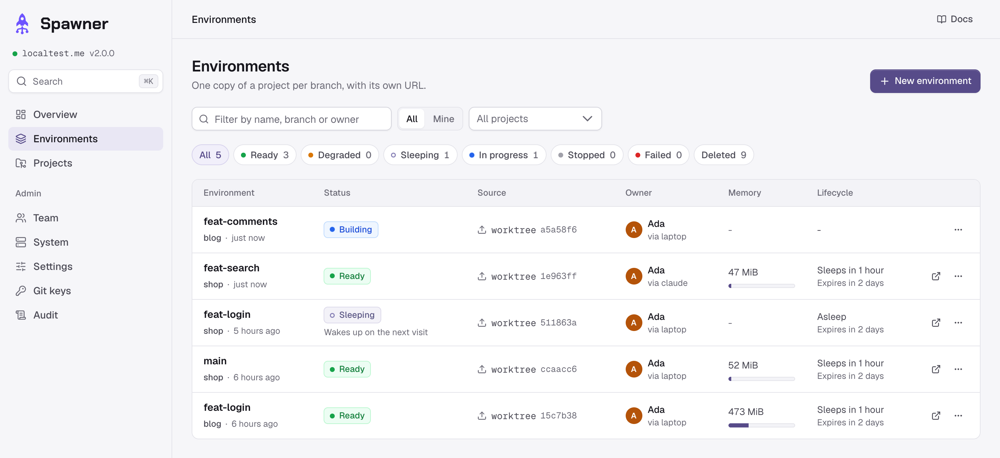
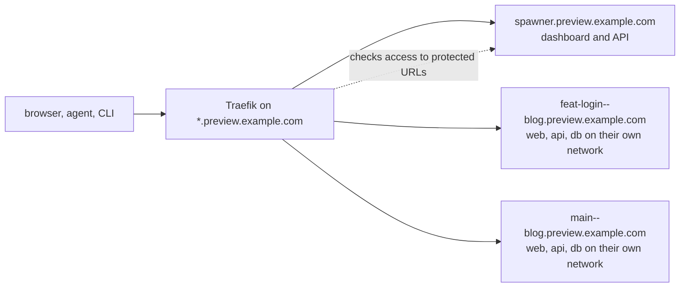

# Spawner

Spawner is an open source, self-hosted preview environment manager: a copy of your app for each git branch, on your own server, with its own URLs, database and logs, for teams and their coding agents.

[Website](https://spawner.run) · [Documentation](https://spawner.run/docs/) · [Compare](https://spawner.run/compare/) · [Changelog](https://spawner.run/changelog/) · [Releases](https://github.com/Flosk6/Spawner/releases) · [npm](https://www.npmjs.com/package/spawner-cli)

[](https://github.com/Flosk6/Spawner/actions/workflows/ci.yml)
[](https://github.com/Flosk6/Spawner/releases)
[](https://www.npmjs.com/package/spawner-cli)
[](LICENSE)

Spawner builds preview environments (also called review apps or ephemeral environments) from your project's Docker Compose file, without Kubernetes. Developers, reviewers and coding agents start one from a branch, or from a worktree with its uncommitted changes, then open it, run commands in it, read its logs, share it and delete it. Environments nobody uses go to sleep, so many fit on one server. Free under Apache-2.0.

**Status**: out of beta since 2.1.0. Only the latest release gets fixes, and the dashboard updates a server in one click.

<picture>
  <source media="(prefers-color-scheme: dark)" srcset=".github/assets/dashboard-dark.png">
  
</picture>

```text
$ cd ~/code/blog-feat-login          # an agent's worktree, branch feat/login
$ spawner up --wait
feat-login (blog) is ready
  web  https://feat-login--blog.preview.example.com
  api  https://api--feat-login--blog.preview.example.com
$ spawner exec -i feat-login db -- mysql -uapp -papp app < fixtures.sql
$ spawner logs feat-login api --errors
$ spawner share feat-login           # a link for someone without an account
$ spawner down feat-login
```

## Quick start

On a server dedicated to previews (Ubuntu 22.04 or 24.04, Debian 12, amd64 or arm64; at least 4 GiB of memory, 8 GiB or more advised), with a DNS record `*.preview.example.com` pointing to it:

```bash
curl -fsSL https://github.com/Flosk6/Spawner/releases/latest/download/install.sh | sudo bash
```

The installer asks for the domain, an e-mail and your DNS provider (for one wildcard certificate), installs Docker if needed, starts Spawner, and prints the link that creates the first admin account. Then, on your machine (Node.js 20 or later), in a project:

```bash
npm install -g spawner-cli
spawner login https://spawner.preview.example.com
spawner init
```

`spawner init` writes `.spawner/` (a manifest and a Docker Compose file, to adjust), offers to add the instructions for coding agents, and prints the project's slug. An admin adds the project in the dashboard (Projects, New project): that slug, the repository, and the directory of `.spawner/` in a monorepo. Then `spawner up --wait` starts the environment of the branch. [The quick start](https://spawner.run/docs/quickstart/) goes through each step, and [the examples](https://spawner.run/docs/examples/) (Node.js and PostgreSQL; Laravel, Next.js and MySQL) are ready to deploy.

## How it works



A project describes its environment in its repository, in `.spawner/`: a manifest that names its URLs and its seed, and a regular Docker Compose file.

```yaml
# .spawner/spawner.yaml
version: 1
project: blog
exposures:
  - { name: web, service: web, port: 3000 }
  - { name: api, service: api, port: 8000 }
seed:
  - { service: api, run: [php, artisan, migrate, --seed, --force] }
```

For each environment, Spawner checks out the branch or receives the worktree, checks the compose file against a security policy, builds and starts it on its own Docker network, seeds it, and routes its URLs through Traefik with HTTPS. Updates keep the data. Every change is a job with a live log, whether it comes from the dashboard, the CLI, the MCP server or the API.

## For coding agents

An agent tests its own work in a real environment, from its worktree, without pushing:

- `spawner up --wait --json`: commands print JSON with `--json` and exit with stable codes (4: the environment failed, with the end of the build log; 6: quota or capacity reached; 7: `.spawner/` refused, with what to fix);
- `spawner url --with-token` gives the header that opens protected URLs, for curl or Playwright;
- `spawner exec` runs a command in any service; `spawner logs --errors` keeps the error lines, stack traces whole; `spawner status` says which service crashed and why;
- `spawner mcp` is an MCP server for Claude Code, Codex, Cursor and other clients (`claude mcp add spawner -- spawner mcp`), with nine tools: `spawner_up`, `spawner_status`, `spawner_list`, `spawner_logs`, `spawner_exec`, `spawner_stats`, `spawner_url`, `spawner_share` and `spawner_down`;
- each agent on its own branch gets its own environment and database; agents deploying at once do not get in each other's way.

See [coding agents](https://spawner.run/docs/agents/) and [the CLI](https://spawner.run/docs/cli/).

## Many environments on one server

- **Sleep**: after 2 hours (by default) without a visit or an action, an environment's containers stop; the next visit to a protected URL wakes it up within seconds.
- **Shared layers**: environments share their base images and dependencies; each one only adds its code and build output (about 4 MiB for the Laravel example). Spawner warns about Dockerfiles that prevent it: see [making environments cheap](https://spawner.run/docs/manifest/#making-environments-cheap).
- **Capacity**: Spawner says how many more environments of each project fit, from what they really use, and refuses one that does not fit.
- **Lifetime and quotas**: by default, environments expire after 72 hours unless someone deploys them again, and each person may own 5. Spawner cleans up what deleted environments leave, and nothing else.

## Supervision

Each environment has its logs (by service, errors only, live), the CPU and memory of each service over time, its disk, a timeline of crashes, out-of-memory kills and failing healthchecks, and a terminal into any service; a deleted one stays readable for 7 days. Admins see the server: alerts, 30 days of history, every container, and how many more environments fit.

## Security

Branches run unreviewed code: compose files are checked against an allowlist (no host mounts, privileged containers, host network or Docker socket), each environment has its own network, Traefik has no Docker socket, and the server is meant for previews only. Accounts have no passwords (invitations and passkeys, GitHub optional); tokens have scopes and expiries; previews are protected by default, and Spawner's cookies never reach the applications. An audit trail records who did what. No telemetry: on its own, Spawner only asks GitHub for new releases (`SPAWNER_UPDATE_CHECK=false` turns that off). See [security](https://spawner.run/docs/security/).

## What Spawner does not do

One installation runs previews on one server, from Docker Compose: no production, no Kubernetes, no cluster, and no environment opened by itself for a pull request (CI calls `spawner up`, see [the CI guide](https://spawner.run/docs/ci/)). See [the whole list](https://spawner.run/docs/concepts/#what-spawner-does-not-do), and [the comparison](https://spawner.run/compare/) with other tools.

## Documentation

- [Quick start](https://spawner.run/docs/quickstart/): from a fresh install to the first environment
- [Installing](https://spawner.run/docs/install/): requirements, DNS providers, options, upgrades, removal
- [Concepts](https://spawner.run/docs/concepts/): projects, environments, jobs, lifecycle, access, limits
- [The manifest](https://spawner.run/docs/manifest/): `.spawner/`, its rules, and what makes environments cheap
- [The CLI and the MCP server](https://spawner.run/docs/cli/): commands, JSON outputs, exit codes, MCP tools
- [Coding agents](https://spawner.run/docs/agents/): Claude Code, Codex, Cursor
- [Pull requests in CI](https://spawner.run/docs/ci/): previews from GitHub Actions and GitLab CI
- [Examples](https://spawner.run/docs/examples/) and [troubleshooting](https://spawner.run/docs/troubleshooting/)
- [Security](https://spawner.run/docs/security/), [operations](https://spawner.run/docs/operations/) (backups, disk, monitoring), [configuration](https://spawner.run/docs/configuration/) (every setting)
- [Architecture](https://spawner.run/docs/architecture/): how Spawner is built, for contributors

## Development

```text
apps/
├── api/        NestJS, Prisma (PostgreSQL): the API and the environment engine
├── cli/        The spawner CLI and MCP server, bundled into one file
└── web/        Vue 3, Vite, Tailwind CSS, PrimeVue
packages/
├── core/       Manifest, compose policy and rendering (pure, shared with the CLI)
├── types/      API types shared by the web app and the CLI
└── utils/      Git input validators
examples/       Projects ready to deploy
scripts/        End-to-end tests, the capacity check, the release
```

Requirements: Docker with Compose v2, Node.js 22 and pnpm 8.

```bash
pnpm install && pnpm build
cp .env.example .env            # set SPAWNER_DATA_DIR to an absolute path
docker compose up -d --build    # Postgres, Traefik, Spawner: http://spawner.localtest.me
docker logs spawner             # the link that creates the first admin account
pnpm dev                        # or the API on :3000, the web app on :8080, hot reload
pnpm lint && pnpm typecheck && pnpm test
scripts/e2e-engine.sh           # end to end: a local stack, the API, the CLI and MCP
```

Every subdomain of `localtest.me` resolves to 127.0.0.1. Over plain HTTP, browsers allow passkeys on `localhost` only: a local install lets invitations log in without one. See [scripts](scripts/README.md) for the tests.

## Contributing

Issues are welcome: bugs, questions and ideas. Pull requests from outside are not accepted for now; see [contributing](CONTRIBUTING.md). Report vulnerabilities privately: [security policy](SECURITY.md).

## License

[Apache-2.0](LICENSE): free to use, modify and distribute, commercially too. Copyright 2025-2026 Flosk6.
